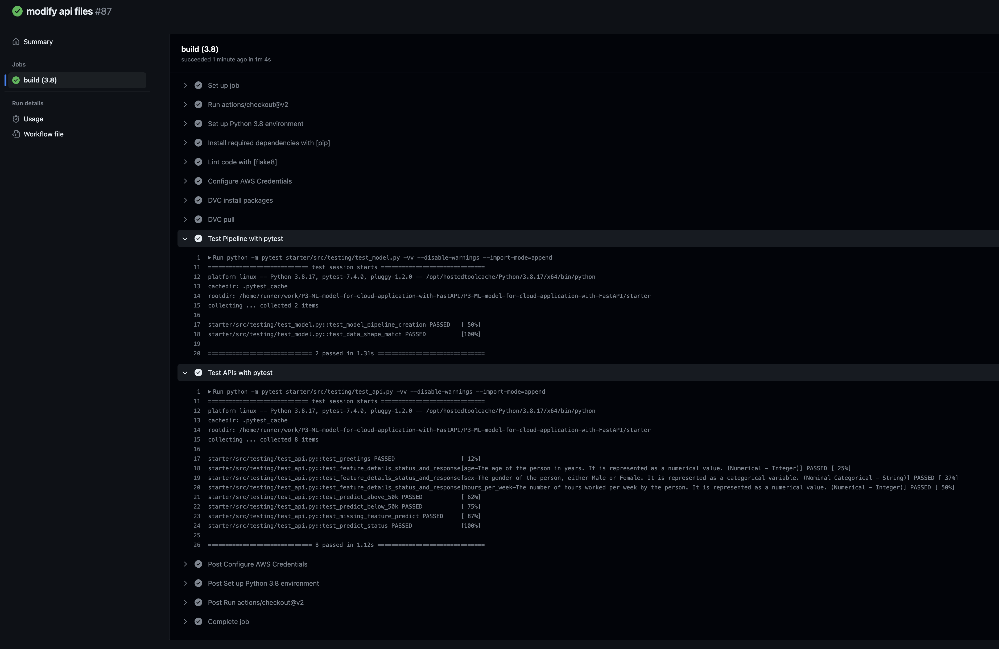

## Project 3: Deploying ML Model for Cloud Application with FastAPI
The third project [ML DevOps Engineer Nanodegree](https://www.udacity.com/course/machine-learning-dev-ops-engineer-nanodegree--nd0821) by Udacity. In this project, we will develop a classification model on publicly available `Census Bureau` [dataset](https://archive.ics.uci.edu/dataset/20/census+income), along with the following actions:
1. Create unit tests to monitor the model performance on various data slices. 
2. Deploy a model using the FastAPI package and create API tests. 
3. Incorporate the slice validation and the API tests into a CI/CD framework using GitHub Actions.

**Kindly note**: Instructions on how to set up required nvironment & repositories are available in udacity's [repository](https://github.com/udacity/nd0821-c3-starter-code/tree/master/starter)


### Prerequisites
* Python and Jupyter Notebook for Exploratory Data Analysis (EDA) process
* AWS account with S3 bucket for Data Version Control (DVC)
* Github account to use Github Actions for Continuous Integration (CI)
* Heroku or Render account for Continuous Deployment (CD)
* Linux environment may be needed within windows through WSL

### Installation
* Download and install `conda`
* Creat an environment:
    ```
    conda create -n <ENV-NAME> "python=3.8" scikit-learn pandas numpy pytest jupyter jupyterlab fastapi uvicorn -c conda-forge 
    ```
* Install `git`:
    ```
    sudo apt-get git
    ```

* Use the package manager `pip` to install the dependencies from the [requirements.txt] (_recommended to install it in a separate virtual environment_)
    ```
    pip install -r requirements.txt
    ```


### Project files
```
📦 P3-ML-model-for-cloud-application-with-FastAPI
 ┣ 📂 .github
 ┃  ┗ 📂 workflows
 ┃    ┗ 📜 main.yml             # Github Action yml file
 ┣ 📂 starter
 ┃  ┣ 📂 data                   # Dataset & EDA notebook folder
 ┃  ┣ 📂 model                  # Trained serialized models with matrics
 ┃  ┣ 📂 screenshots            # Screenshots for validating project's rubric
 ┃  ┣ 📂 src                
 ┃  ┃  ┣ 📂 app                 # ~~~[ FastAPI folder ]~~~
 ┃  ┃  ┃  ┣ 📜 api.py           # APIs configuration file
 ┃  ┃  ┃  ┗ 📜 config.yaml      # APIs configuration file
 ┃  ┃  ┣ 📂 pipeline            # ~~~[ Model pipeline folder ]~~~
 ┃  ┃  ┃  ┣ 📜 data.py          # Data processing script
 ┃  ┃  ┃  ┣ 📜 evaluate.py      # Model evaluation script
 ┃  ┃  ┃  ┗ 📜 model.py         # Model architecture and training script
 ┃  ┃  ┣ 📂 testing              # ~~~[ Testing scripts folder]~~~
 ┃  ┃  ┃  ┣ 📜 render_api.py    # Testing Render Live API
 ┃  ┃  ┃  ┣ 📜 test_api.py      # Testing local APIs
 ┃  ┃  ┃  ┗ 📜 test_model.py    # Testing model functionalities
 ┃  ┃  ┗ 📜 main.py             # Main script to train the model and generate metrics
 ┃  ┣ 📜 dictionaries.py        # Config file for important files 
 ┃  ┣ 📜 logging.log            # Logging file
 ┃  ┣ 📜 model_card.md          # Model informative card 
 ┃  ┗ 📜 sanitycheck.py         # Validating API correctness (PROVIDED)
 ┣ 📜 api.py                    # Render (Live API Testing): API script
 ┣ 📜 config.yaml               # Render (Live API Testing): Configuration file (COPY)
 ┣ 📜 model.pki                 # Render (Live API Testing): Deplyed model for CD
 ┣ 📜 requirements.txt          # Projects required dependencies           
 ┗ 📜 README.md   
```

### Usage
1. Running the main script to generate model & its associated matrics:
    ```
    cd starter/src
    python main.py
    ```
2. Start FastAPI application to locally validate API functions: 
    ```
    uvicorn app.api:app --reload --port <PORT-NUM>
    uvicorn app.api:app --reload --port 8007
    ```

3. Brows FastAPI application documentation to manually test API functions:
    ```
    http://127.0.0.1:8007/docs
    ```
    
    
    


4. Testing Model and API scrpits:
    ```
    pytest src/testing -vv --disable-warnings 
    ```
    

    


5. Before sarting CI/CD process, let have a look on tracked DVC components:
    from CLI:
    ```
    dvc dag
    ```
    %20.png "DVC Components")

    from AWS:
    %20%20-%20AWS.png "DVC Components")


6. Activating Continuous Integration (CI) using Github actions: (_will be triggered upon pushing to Github_)

    ```
    git push
    ```
    

7. Activating Continuous Developemnt (CD) using Render Paatform:

    * Deploying APIs:
    

    * APIs Live testing using the browser:
    

    

    * APIs Live testing using a script:
    


### License

Distributed under the [MIT](https://choosealicense.com/licenses/mit/) license. 
